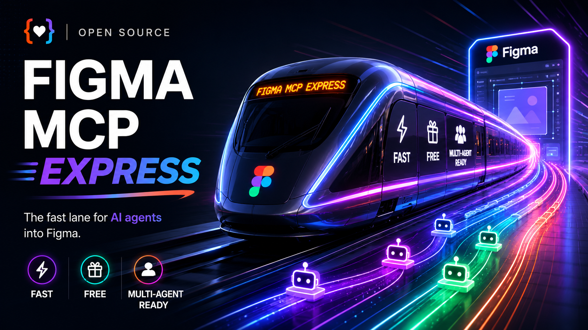
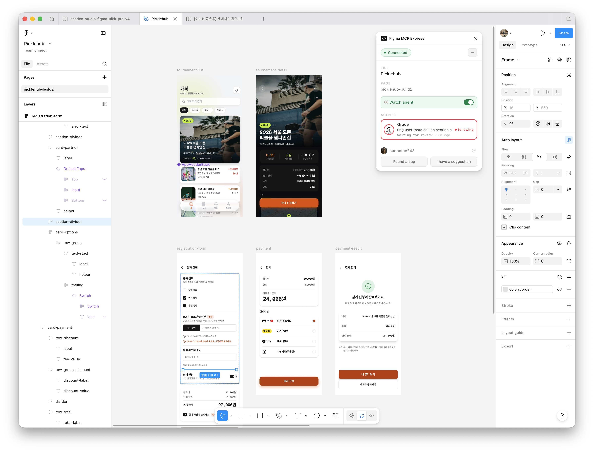

# figma-mcp-express



[](LICENSE)
[](https://go.dev)
[](https://www.npmjs.com/package/figma-mcp-express)
[](https://claude.ai/code)
[](https://github.com/openai/codex)

**Fast, quota-free, stable Figma automation for coding agents.** `figma-mcp-express` lets Claude Code, Codex, and other local agents read, edit, migrate, audit, screenshot, and prototype inside the real Figma Desktop file. It is built for serious design-system work: batch edits, multi-file routing, large-file reads, visible multi-agent activity, and prototype wiring without burning through official Figma MCP tool-call quotas.

Use it when screenshots and comments are not enough. The agent can inspect actual nodes, components, variables, styles, frames, prototype reactions, and connected files, then make targeted changes in the file designers already use.

## Demo

<video src="assets/multi-agent-figma-build-demo.mp4" controls muted playsinline></video>



Follow AI agents live as they fix issues, edit layouts, and design screens directly in Figma.

## Why teams use it

- **More automation, fewer quota walls.** Normal plugin-side work is not capped by the official Figma MCP server's seat-based tool-call limits.
- **Compact tool surface.** Compared with [`vkhanhqui/figma-mcp-go@fe6cd768`](https://github.com/vkhanhqui/figma-mcp-go) (the upstream fork baseline), the default `tools/list` drops from 73 tools / 12,214 `o200k_base` tokens to 21 tools / 3,283 tokens (73.1% smaller) — less context burned before the agent does any work.
- **Real Figma context, not screenshots.** Agents work with live nodes, components, variables, styles, frames, screenshots, and prototype links in the open Desktop file.
- **Built for design-system migration.** Route a source library and product file through separate channels, then rebuild screens with the right components and tokens.
- **Made for multi-agent runs.** Watch agent activity live, follow one agent's edits, and keep file sessions separated by channel.
- **Large files stay usable.** Big reads spill to disk so agents can inspect only the useful slice instead of flooding the model context.
- **Prototype automation is part of the workflow.** Read prototype flows, set reactions, and set flow starting points.

## Capabilities

- Watch live agent activity in the Figma plugin.
- Build polished Figma screens with built-in AI agent skills.
- Route multiple open files through separate channels.
- Migrate design systems with real components, variables, and styles.
- Read and wire prototype flows directly in the open Figma file.

## Good fit

- Design system migrations and component-library swaps
- Large file audits, cleanup, and token rebinding
- Design-to-code handoff that needs real token and component context
- Prompt-to-Figma workflows that should use your actual library instead of raw shapes
- Prototype audits and wiring for navigation, overlays, transitions, and flow starts

## Quick start

### 1. Install the server

Plugin install is the shortest path.

**Claude Code**

```bash
claude plugin marketplace add sunhome243/figma-mcp-express
claude plugin install figma-mcp-express@figma-mcp-express
```

**Codex**

```bash
codex plugin marketplace add sunhome243/figma-mcp-express
codex plugin add figma-mcp-express@figma-mcp-express
```

### 2. Import the Figma Desktop plugin

1. Download [`plugin.zip`](https://github.com/sunhome243/figma-mcp-express/releases/latest/download/plugin.zip) or build from source.
2. In Figma Desktop, go to `Plugins -> Development -> Import plugin from manifest...`.
3. Select `manifest.json` from the unzipped plugin folder or from this repo's `plugin/` directory.

### 3. Run it

1. Open the target file in Figma Desktop.
2. Start `Plugins -> Development -> Figma MCP Express`.
3. Keep the plugin running while the agent works.
4. If you open multiple files, each file gets its own channel ID for multi-file workflows.

## Important limits

- Most live tools require the target file to be open in Figma Desktop with the plugin running.
- `fetch_library_catalog` is the main REST-only exception and requires `FIGMA_TOKEN`.
- Plugin execution is still single-threaded per file; the server reduces contention, but it does not make one file fully parallel.
- Community kits must be published as a library before `import_component_by_key` can use them.

<details>
<summary>Build from source</summary>

For other MCP clients, or if you want to modify the server:

```bash
git clone https://github.com/sunhome243/figma-mcp-express.git
cd figma-mcp-express
make build
```

This produces `bin/figma-mcp-express` and `plugin/dist/`.

Add it to your `.mcp.json`:

```json
{
  "mcpServers": {
    "figma-mcp-express": {
      "command": "/absolute/path/to/bin/figma-mcp-express",
      "args": ["--port", "1994"]
    }
  }
}
```

Restart your MCP client after building.
</details>

<details>
<summary>Advanced environment variables</summary>

### `FIGMA_TOKEN`

Most workflows do not need a token. Live read/write tools talk directly to Figma Desktop through the plugin.

You only need `FIGMA_TOKEN` for REST-backed library catalog lookups such as `fetch_library_catalog`.

- Generate it in Figma at `Account Settings -> Personal access tokens`
- Read-only file access is enough for catalog lookup
- Treat it like a password and never commit it

If you installed from the marketplace, set it in your shell profile:

```bash
echo 'export FIGMA_TOKEN=your_token_here' >> ~/.zshrc
source ~/.zshrc
```

If you built from source, you can either export it in your shell or place it in a local `.env` file:

```bash
cat <<'EOF' > .env
FIGMA_TOKEN=your_token_here
EOF
```

Shell environment variables take precedence over `.env`.

| Variable | Default | Description |
| --- | --- | --- |
| `FIGMA_TOKEN` | - | Required only for `fetch_library_catalog`. |
| `FIGMA_MCP_TOOL_PROFILE` | `core` | `core` keeps the compact default tool surface. `full` restores the legacy compatibility/debugging surface. |
| `FIGMA_MCP_TOOL_SCHEMA_MODE` | `compact` | `compact` trims `tools/list` descriptions to reduce MCP context tokens. Use `verbose` for full in-schema guidance. |
| `FIGMA_MCP_BATCH_MAX_OPS` | `200` | Maximum top-level `batch.ops` entries accepted before plugin execution. |
| `FIGMA_MCP_BATCH_MAX_BYTES` | `2097152` | Maximum encoded `batch.ops` payload size in bytes before plugin execution. |
| `FIGMA_MCP_SPILL_BYTES` | `25000` | Response size threshold. Larger responses spill to `.figma-mcp-cache/`. |
| `FIGMA_MCP_TIMEOUT` | `120` | Inactivity ceiling in seconds for lightweight ops. Resets on each progress heartbeat. |
| `FIGMA_MCP_READ_TIMEOUT` | `600` | Inactivity ceiling in seconds for heavy reads and `batch`. Resets on each progress heartbeat. |
| `FIGMA_MCP_STALL_THRESHOLD` | `45` | Seconds an op may hold a channel's serial slot with no progress before a new call on that channel is fast-rejected. |
</details>

## More docs

- [TOOLS.md](TOOLS.md) for the full tool catalog
- [ARCHITECTURE.md](ARCHITECTURE.md) for queueing, routing, spill-to-disk, and recovery behavior
- [DEV-SETUP.md](DEV-SETUP.md) for local build, rebuild, and test instructions

## Credits

Built on [vkhanhqui/figma-mcp-go](https://github.com/vkhanhqui/figma-mcp-go) (MIT). The original established the core idea: skip the REST API for live file work and talk directly to Figma Desktop over WebSocket.
